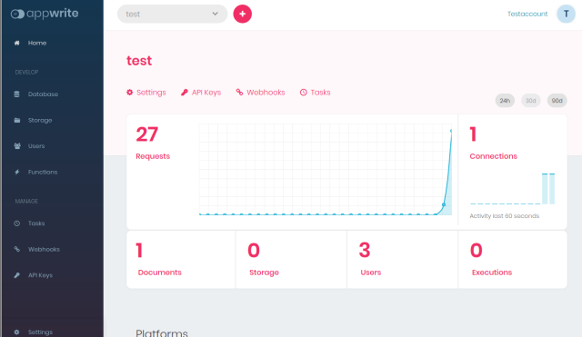

# Titanium module for Appwrite



Titanium Android module using [Appwrite's Android SDK](https://github.com/appwrite/sdk-for-android)

## What is Appwrite:

> Appwrite is an open-source backend as a service server that abstract and simplify complex and repetitive development tasks behind a very simple to use REST API. Appwrite aims to help you develop your apps faster and in a more secure way. Use the Android SDK to integrate your app with the Appwrite server to easily start interacting with all of Appwrite backend APIs and tools. For full API documentation and tutorials go to https://appwrite.io/docs


## Installation

* create and run an Appwrite docker machine: https://appwrite.io/docs/installation
* download `ti.appwrite` module
* add `<module>ti.appwrite</module>` to your `tiapp.xml`
* add the following section to your `<application>` section:
```xml
<application>
	<activity android:name="io.appwrite.views.CallbackActivity" android:exported="true">
		<intent-filter android:label="android_web_auth">
			<action android:name="android.intent.action.VIEW"/>
			<category android:name="android.intent.category.DEFAULT"/>
			<category android:name="android.intent.category.BROWSABLE"/>
			<data android:scheme="appwrite-callback-[PROJECT_ID]"/>
		</intent-filter>
	</activity>
</application>
```

## Appwrite setup

Start the docker machine and create a new project. Make sure to add an `Android platform` with your package name. Under `Settings` you will find the `Project ID`.

## Titanium setup

```js
var appwrite = require("ti.appwrite");
appwrite.create({
	endpoint: SERVER_URL,
	project: PROJECT_ID,
	selfSigned: true,
	channels: ["files", "account"]
});
```
Full example: [app.js](example/app.js)<br/>
Full tutorial at: [from zero to app: Appwrite + Titanium: A step by step guide](https://fromzerotoapp.com/appwrite-appcelerator-titanium-a-step-by-step-guide/)

## Methods

* create()
* checkConnection()

* createAccount()
* deleteAccount()
* createSession()
* getAccount()

* getDocuments()
* getDocument()
* deleteDocument()
* createDocument({})

* subscribe([])
* unsubscribe([])

* createFile({file, read[], write[]})
* listFiles();
* getFile(id)
* getPreview({id:string, width?:int, height?:int, quality?:int})
* downloadFile(id)
* deleteFile(id);

## Events
* account
* error: action, message, code, response
* realtimeEvent
* database: e.documents for list
* storage: e.blob for file download, e.files for file list
* connection: status (true/false)

## Author

* Michael Gangolf (<a href="https://github.com/m1ga">@MichaelGangolf</a> / <a href="https://www.migaweb.de">Web</a>)

<span class="badge-buymeacoffee"><a href="https://www.buymeacoffee.com/miga" title="donate"></a></span>
